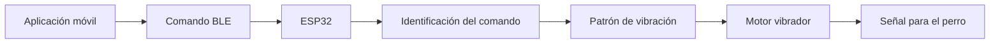

# 🐶 SmartLeash ESP32

Firmware del sistema embebido de SmartLeash para recibir comandos mediante Bluetooth Low Energy (BLE) y activar patrones de vibración en un motor conectado a un ESP32.

SmartLeash es un prototipo de comunicación asistida para perros con pérdida auditiva. Cada comando recibido se transforma en un patrón háptico diferente.

> La aplicación, el firmware y el prototipo físico existen. La integración App → BLE → ESP32 → motor se encuentra actualmente en revalidación.

---

## 🎯 Objetivo del firmware

El firmware permite que el ESP32:

- Funcione como servidor BLE.
- Anuncie el dispositivo con el nombre `SmartLeash`.
- Espere la conexión de un cliente.
- Reciba comandos mediante una característica BLE.
- Identifique los comandos `1`, `2` y `3`.
- Active el motor conectado al GPIO 32.
- Genere un patrón de vibración diferente para cada comando.
- Reinicie el anuncio BLE cuando un cliente se desconecta.
- Muestre información de depuración en el monitor serial.

---

## 📱 Comandos y patrones hápticos

| ID recibido | Comando | Patrón programado |
|---|---|---|
| `"1"` | **Vámonos** | Una vibración de 300 ms |
| `"2"` | **Fea** | Dos vibraciones de 200 ms, separadas por 200 ms |
| `"3"` | **Quieta** | Una vibración prolongada de 1000 ms |

Cualquier valor diferente se registra como:

```text
Comando desconocido
```

Los patrones pueden ajustarse posteriormente de acuerdo con las pruebas técnicas y la validación conductual.

---

## 🔄 Flujo de funcionamiento



El significado de cada vibración debe construirse mediante entrenamiento, asociación y refuerzo positivo.

---

## 📡 Configuración Bluetooth Low Energy

El ESP32 se configura como servidor BLE.

### Nombre anunciado

```text
SmartLeash
```

### UUID del servicio

```text
00001234-0000-1000-8000-00805f9b34fb
```

### UUID de la característica

```text
0000ABCD-0000-1000-8000-00805f9b34fb
```

La característica permite las operaciones:

- Lectura.
- Escritura.

La aplicación debe conectarse al servicio y escribir el identificador del comando en la característica correspondiente.

Ejemplos:

```text
1
2
3
```

---

## ⚙️ Hardware utilizado

- ESP32.
- Motor vibrador tipo moneda.
- Transistor NPN 2N2222.
- Resistencia de 1 kΩ.
- Diodo 1N4007.
- Batería LiPo de 3.7 V.
- Módulo cargador TP4056.
- Convertidor elevador MT3608 ajustado a 5 V.
- Interruptor de encendido y apagado.
- Placa y carcasa para el montaje.

---

## 🔌 Pin utilizado

El motor se controla mediante:

```cpp
#define MOTOR_PIN 32
```

El GPIO 32 envía la señal de control hacia la base del transistor mediante una resistencia de 1 kΩ.

```text
GPIO 32
   ↓
Resistencia de 1 kΩ
   ↓
Base del transistor 2N2222
   ↓
Motor vibrador
```

> El motor no debe conectarse directamente al GPIO del ESP32. El transistor permite controlar la carga sin exigir al pin una corriente superior a la recomendada.

El circuito también utiliza un diodo en paralelo con el motor para ayudar a protegerlo frente a los picos generados por la carga inductiva.

---

## 📂 Estructura del repositorio

```text
SmartLeash-ESP32/
│
├── SmartLeashESP32.ino
└── README.md
```

---

## 🛠️ Requisitos de software

Para compilar y cargar el firmware se necesita:

- Arduino IDE.
- Soporte para placas ESP32.
- Cable USB de datos.
- Controlador USB correspondiente al ESP32.
- Puerto serial disponible.

Las bibliotecas BLE utilizadas forman parte del soporte de ESP32 para Arduino:

```cpp
#include <BLEDevice.h>
#include <BLEServer.h>
#include <BLEUtils.h>
#include <BLE2902.h>
```

---

## 📥 Configurar el ESP32 en Arduino IDE

### 1. Abrir Arduino IDE

Inicia Arduino IDE y abre el archivo:

```text
SmartLeashESP32.ino
```

### 2. Instalar el soporte para ESP32

Desde el administrador de tarjetas, instala:

```text
esp32 by Espressif Systems
```

### 3. Seleccionar la placa

Selecciona la placa ESP32 compatible con el dispositivo utilizado.

### 4. Seleccionar el puerto

Selecciona el puerto COM correspondiente al ESP32.

Ejemplo:

```text
COM3
```

### 5. Compilar

Presiona el botón de verificación para comprobar que el firmware compile correctamente.

### 6. Cargar el firmware

Conecta el ESP32 mediante USB y presiona el botón de carga.

Durante las pruebas de programación:

- Mantén la batería desconectada.
- Mantén el interruptor apagado.
- Alimenta el ESP32 únicamente mediante USB.
- No modifiques las conexiones físicas mientras el dispositivo esté energizado.

En algunas placas puede ser necesario mantener presionado el botón `BOOT` durante el inicio de la carga.

---

## 🖥️ Monitor serial

El firmware utiliza la velocidad:

```cpp
Serial.begin(115200);
```

Por lo tanto, el monitor serial debe configurarse a:

```text
115200 baudios
```

### Mensaje inicial

Cuando el dispositivo inicia correctamente, muestra:

```text
SmartLeash listo y esperando conexión...
```

### Conexión de un cliente

```text
Cliente conectado
```

### Recepción de un comando

```text
Comando recibido: 1
VÁMONOS
```

### Desconexión

```text
Cliente desconectado
```

Cuando el cliente se desconecta, el ESP32 vuelve a iniciar el anuncio BLE para permitir una nueva conexión.

---

## ⚠️ Solución de problemas de carga

Durante las pruebas puede aparecer alguno de estos errores:

```text
Failed to connect to ESP32: Invalid head of packet (0xC1)
```

o:

```text
Failed to connect to ESP32: No serial data received
```

Estos mensajes corresponden a un problema de comunicación durante la carga y no necesariamente a un error del código C++.

Se recomienda revisar:

- Que el cable USB permita transferencia de datos.
- Que el puerto COM seleccionado sea el correcto.
- Que el controlador USB esté instalado.
- Que no haya otro programa utilizando el puerto.
- Que la placa seleccionada sea compatible.
- Que la batería permanezca desconectada durante la programación.
- Que el interruptor esté apagado.
- El procedimiento de los botones `BOOT` y `EN/RST`.
- La estabilidad de la alimentación por USB.

Un mensaje como el siguiente indica que la carga finalizó y la placa se reinició:

```text
Hard resetting via RTS pin...
```

---

## 🧪 Estado de las pruebas

| Componente | Estado |
|---|---|
| Código del servidor BLE | 🟢 Desarrollado |
| Identificación de comandos | 🟢 Desarrollada |
| Patrones de vibración | 🟢 Programados |
| Carga del firmware | 🟢 Realizada |
| ESP32 mediante USB | 🟢 Funcional |
| Conexión App → BLE → ESP32 | 🟠 En revalidación |
| Activación física del motor | 🟠 En revalidación |
| Funcionamiento con batería | ⚪ Pendiente de validación |
| Entrenamiento con Fea | ⚪ Pendiente/en preparación |
| Validación conductual | ⚪ Pendiente |

### Leyenda

- 🟢 Implementado
- 🟠 En revalidación
- ⚪ Pendiente

---

## 🔐 Consideraciones de seguridad

La versión actual implementa la comunicación BLE necesaria para recibir los comandos del prototipo.

Como parte de la evolución del proyecto se contempla:

- Emparejamiento seguro.
- Autenticación del dispositivo.
- Protección de los comandos.
- Validación del cliente conectado.
- Control de conexiones no autorizadas.
- Actualizaciones seguras del firmware.

> Estos controles forman parte de los requisitos de ciberseguridad del proyecto y no deben interpretarse como completamente implementados o auditados en el firmware actual.

---

## 🗺️ Próximas etapas

1. Revalidar la comunicación con la aplicación móvil.
2. Confirmar la recepción de los tres comandos mediante BLE.
3. Revalidar la activación física del motor.
4. Probar los patrones programados.
5. Validar el funcionamiento con batería.
6. Reemplazar los `delay()` por una lógica no bloqueante si el prototipo requiere ejecutar otras tareas simultáneamente.
7. Implementar controles de autenticación y protección BLE.
8. Registrar los resultados técnicos.
9. Iniciar las pruebas progresivas con Fea.
10. Documentar la validación conductual.

---

## 🔗 Repositorios relacionados

- Aplicación móvil y módulo experimental de IA: [SmartLeash](https://github.com/LOLA-1980/smartleash)
- Firmware del ESP32: [SmartLeash ESP32](https://github.com/LOLA-1980/SmartLeash-ESP32)

---

## 👩‍💻 Autora

**Lillys Hernández Ramos**

Ingeniera en Sistemas Computacionales  
Creadora y desarrolladora de SmartLeash

- GitHub: [LOLA-1980](https://github.com/LOLA-1980)

**SmartLeash — 2026**

---

## 💙 Frase del proyecto

> “Porque la comunicación siempre ha existido; SmartLeash la adapta a las nuevas necesidades de tu mejor amigo.”
