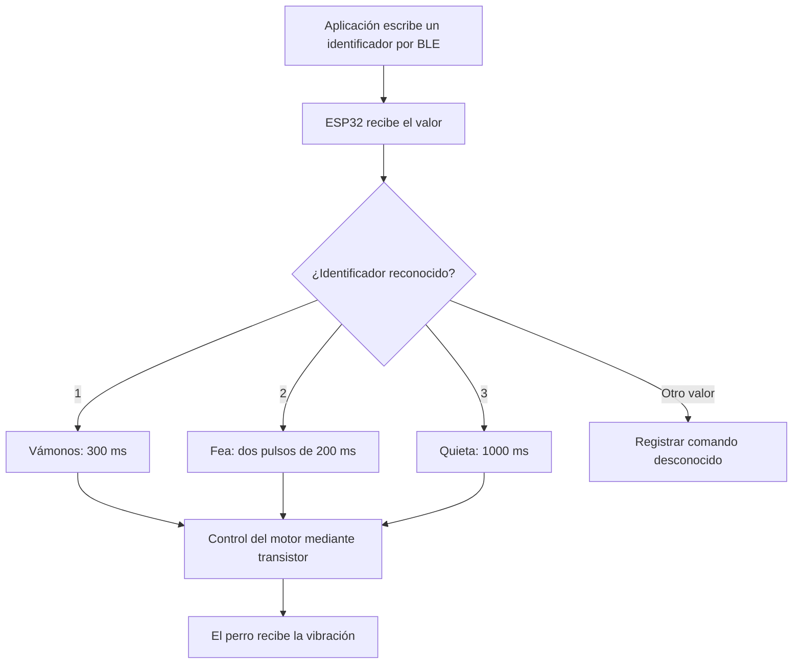

# 🐶 SmartLeash ESP32

## Firmware del dispositivo háptico para perros con pérdida auditiva

Firmware del sistema embebido de SmartLeash, desarrollado para recibir comandos mediante Bluetooth Low Energy (BLE) y ejecutar patrones de vibración mediante un ESP32.

SmartLeash es un prototipo de comunicación asistida para **perros con pérdida auditiva**. Las personas cuidadoras son usuarias de la aplicación.

El dispositivo transmite señales hápticas cuyo significado debe construirse mediante entrenamiento, asociación y refuerzo positivo.

**SmartLeash no restaura la audición ni garantiza automáticamente una respuesta conductual.**

> La aplicación, el firmware y el prototipo físico existen. La integración App → BLE → ESP32 → motor se encuentra en revalidación.

---

## 🎯 Objetivo del firmware

El firmware documentado está desarrollado para:

- Configurar el ESP32 como servidor BLE.
- Anunciar el dispositivo con el nombre `SmartLeash`.
- Recibir conexiones de un cliente.
- Recibir identificadores mediante una característica BLE.
- Identificar los comandos `1`, `2` y `3`.
- Controlar el motor mediante el GPIO 32 y una etapa de potencia.
- Ejecutar un patrón temporal diferente para cada comando.
- Reiniciar el anuncio BLE después de una desconexión.
- Mostrar mensajes de depuración en el monitor serial.

La programación de estas funciones no sustituye la validación física del sistema completo.

---

## 🧩 Papel del firmware en SmartLeash

La solución completa contempla dos modalidades:

| Modalidad | Origen del comando | Estado |
|---|---|---|
| **Manual** | La persona selecciona un botón en la aplicación | Alcance principal del MVP |
| **Por voz** | Un modelo reconoce una palabra y el sistema evalúa su autorización | Reconocimiento experimental; integración y controles pendientes |

Ambas modalidades están diseñadas para converger en un comando enviado al collar mediante BLE.

**El firmware actual no reconoce voz ni identifica a la persona que habla.** Su función documentada consiste en recibir identificadores y ejecutar los patrones programados.

La captura de audio, el reconocimiento de palabras y la futura verificación de hablante corresponden al componente de aplicación e IA.

El collar también necesita controles propios para autorizar al cliente BLE: verificar la voz en la aplicación no basta para proteger el dispositivo frente a otro cliente que intente enviar comandos.

---

## 📱 Comandos y patrones hápticos

| ID recibido | Comando | Propósito previsto | Patrón programado |
|---|---|---|---|
| `"1"` | **Vámonos** | Señal relacionada con iniciar o continuar el movimiento | Una vibración de 300 ms |
| `"2"` | **Fea** | Señal para llamar la atención de Fea | Dos vibraciones de 200 ms, separadas por 200 ms |
| `"3"` | **Quieta** | Señal relacionada con permanecer quieta | Una vibración de 1000 ms |

Estos valores describen los patrones programados, no su eficacia conductual ni su adecuación para todos los perros.

Los patrones podrán ajustarse después de realizar pruebas técnicas y de bienestar animal.

### Valores no reconocidos

Según el comportamiento documentado, un valor diferente se registra como:

```text
Comando desconocido
```

Debe comprobarse en las pruebas que una entrada desconocida no active el motor.

Reconocer un identificador válido no equivale a verificar que su emisor esté autorizado.

### Patrones de la aplicación y del firmware

El firmware documentado reconoce tres identificadores y utiliza patrones predefinidos.

Crear o modificar un comando en la aplicación no demuestra que el collar pueda recibir y ejecutar cualquier patrón personalizado.

La correspondencia entre los comandos de la aplicación y los patrones del firmware debe validarse durante la integración.

### Duración e intensidad

Los patrones actuales se diferencian mediante duración, pausas y número de activaciones.

No se afirma que el firmware disponga de un control validado de intensidad variable.

---

## 🔄 Flujo de funcionamiento

El siguiente diagrama representa el comportamiento funcional documentado, no una comunicación segura ya certificada ni una integración física completamente validada.



La recepción de una vibración no implica que el perro conozca su significado. La asociación requiere entrenamiento y evidencia conductual.

---

## 📡 Configuración Bluetooth Low Energy

El ESP32 se configura como servidor BLE.

### Nombre anunciado

```text
SmartLeash
```

### UUID del servicio

```text
00001234-0000-1000-8000-00805f9b34fb
```

### UUID de la característica

```text
0000ABCD-0000-1000-8000-00805f9b34fb
```

### Operaciones documentadas

- Lectura.
- Escritura.

La aplicación debe localizar el servicio y escribir el identificador en la característica correspondiente.

### Formato de los comandos

La interfaz documentada utiliza los caracteres de texto:

- `"1"`
- `"2"`
- `"3"`

Cada comando debe enviarse en una escritura independiente.

Es necesario comprobar que aplicación y firmware coincidan en la codificación: el carácter de texto `"1"` no es lo mismo que un byte numérico con valor `0x01`.

También debe verificarse el tratamiento de espacios y saltos de línea. No deben añadirse si el firmware no los contempla.

### Consideraciones de seguridad

El nombre anunciado y los UUID identifican el dispositivo y sus servicios; **no son contraseñas ni mecanismos de autenticación**.

Encontrar el dispositivo, conectarse a él o conocer sus UUID no debería otorgar por sí mismo permiso para activar el motor. Esa restricción requiere controles adicionales.

---

## ⚙️ Hardware documentado

- ESP32.
- Motor vibrador tipo moneda.
- Transistor NPN 2N2222.
- Resistencia de 1 kΩ.
- Diodo 1N4007.
- Batería LiPo de 3.7 V.
- Módulo cargador TP4056.
- Convertidor elevador MT3608 ajustado a 5 V.
- Interruptor de encendido y apagado.
- Placa de montaje.
- Carcasa de protección.

### Compatibilidad eléctrica

Antes de energizar el circuito se deben verificar:

- Voltaje nominal y corriente del motor.
- Modelo y especificaciones de la placa ESP32.
- Salida del convertidor.
- Polaridad de batería y alimentación.
- Orientación y patillaje del transistor.
- Orientación del diodo.
- Capacidad y protección del sistema de batería.
- Ausencia de cortocircuitos.

**Que el MT3608 esté ajustado a 5 V no significa que cualquier motor vibrador admita ese voltaje.**

La descripción de componentes no sustituye un esquema eléctrico completo ni una revisión del montaje.

---

## 🔌 Control del motor

El firmware utiliza:

```cpp
#define MOTOR_PIN 32
```

El GPIO 32 proporciona la señal de control, no la alimentación del motor.

### Etapa de conmutación documentada

| Elemento | Función |
|---|---|
| GPIO 32 | Entrega la señal de control |
| Resistencia de 1 kΩ | Limita la corriente hacia la base del transistor |
| Transistor 2N2222 | Conmuta la corriente del motor |
| Motor vibrador | Genera la señal física |
| Diodo en paralelo con el motor | Ayuda a limitar los picos inductivos de desconexión |

En la configuración de conmutación por el lado de tierra, el colector se conecta al lado negativo del motor y el emisor a tierra. El patillaje debe comprobarse para el transistor específico utilizado.

El ESP32 y la etapa de control necesitan una referencia de tierra común.

> El motor no debe conectarse directamente al GPIO del ESP32.

El diodo debe instalarse con la orientación adecuada para no conducir durante la alimentación normal del motor.

---

## 📂 Archivos principales

| Archivo | Contenido |
|---|---|
| `SmartLeashESP32.ino` | Código del firmware |
| `README.md` | Documentación del repositorio |

---

## 🛠️ Requisitos de software

Para compilar y cargar el firmware se necesita:

- Arduino IDE.
- Soporte para la placa ESP32 utilizada.
- Cable USB de datos.
- Controlador USB correspondiente a la placa.
- Puerto serial disponible.

### Bibliotecas documentadas

```cpp
#include <BLEDevice.h>
#include <BLEServer.h>
#include <BLEUtils.h>
#include <BLE2902.h>
```

Estas bibliotecas pertenecen al entorno BLE del soporte Arduino para ESP32 utilizado por el proyecto.

La compatibilidad debe comprobarse con la versión instalada del paquete de placas. Los cambios de versión pueden requerir ajustes en el código.

Se recomienda registrar la versión con la que se obtiene una compilación y carga correctas.

---

## 📥 Configurar el ESP32 en Arduino IDE

### 1. Abrir el firmware

Abre:

```text
SmartLeashESP32.ino
```

### 2. Instalar el soporte de placas

En el administrador de tarjetas, localiza:

```text
esp32 by Espressif Systems
```

Instala una versión compatible con el código y la placa.

### 3. Seleccionar la placa

Selecciona el modelo correspondiente al dispositivo utilizado.

### 4. Seleccionar el puerto

Selecciona el puerto detectado al conectar la placa.

Por ejemplo:

```text
COM3
```

El número de puerto depende del equipo y no tiene que ser siempre `COM3`.

### 5. Compilar

Utiliza el botón de verificación.

La compilación correcta confirma que el código puede construirse con la configuración seleccionada; no demuestra que el circuito o BLE funcionen físicamente.

### 6. Cargar

Conecta el ESP32 mediante USB y utiliza el botón de carga.

Durante la programación:

- Mantén la batería desconectada.
- Mantén apagada la alimentación autónoma.
- Evita alimentar la placa simultáneamente desde fuentes no verificadas.
- No cambies conexiones mientras el circuito esté energizado.
- Mantén el dispositivo fuera del perro.

En algunas placas puede ser necesario utilizar el botón `BOOT` durante el inicio de la conexión de carga.

El procedimiento depende de la placa y de su circuito de reinicio automático.

---

## 🖥️ Monitor serial

La velocidad documentada es:

```cpp
Serial.begin(115200);
```

Configura el monitor serial a:

```text
115200 baudios
```

La velocidad del monitor serial es independiente de la velocidad seleccionada para cargar el firmware.

### Mensaje inicial esperado

```text
SmartLeash listo y esperando conexión...
```

### Conexión de un cliente

```text
Cliente conectado
```

### Recepción de un comando

```text
Comando recibido: 1
VÁMONOS
```

### Desconexión

```text
Cliente desconectado
```

El comportamiento documentado reinicia el anuncio BLE después de una desconexión.

Los mensajes exactos deben corresponder con la versión del archivo `.ino` cargada.

**Un mensaje serial de recepción no demuestra por sí solo que el motor haya vibrado.** Ambos resultados deben verificarse por separado.

---

## 🧪 Procedimiento de validación técnica

Las primeras pruebas deben realizarse en banco, sin colocar el dispositivo en el perro.

### 1. Verificar arranque

- Cargar el firmware.
- Abrir el monitor serial.
- Confirmar el mensaje de inicio.
- Registrar placa, versión del firmware y alimentación utilizada.

### 2. Verificar anuncio y conexión BLE

- Buscar el dispositivo.
- Confirmar el nombre y los UUID.
- Establecer la conexión.
- Revisar el mensaje serial.

### 3. Verificar comandos

Enviar cada identificador de forma independiente:

| Prueba | Valor enviado | Resultado esperado |
|---|---|---|
| Comando 1 | `"1"` | Patrón de 300 ms |
| Comando 2 | `"2"` | Dos pulsos de 200 ms con pausa de 200 ms |
| Comando 3 | `"3"` | Patrón de 1000 ms |
| Entrada desconocida | Un valor fuera de los admitidos | Registro de comando desconocido y ninguna nueva activación |

Los resultados esperados deben contrastarse con observaciones reales.

### 4. Verificar integración con la aplicación

- Confirmar que cada botón envía el identificador correcto.
- Verificar la recepción en el ESP32.
- Comprobar la activación física.
- Distinguir la vibración del teléfono de la vibración del collar.

### 5. Verificar desconexión y reconexión

- Desconectar el cliente.
- Confirmar que el dispositivo vuelve a anunciarse.
- Comprobar la reconexión.
- Observar si aparecen activaciones inesperadas.

### 6. Validar alimentación autónoma

Después de revisar el circuito:

- Comprobar funcionamiento con batería.
- Evaluar estabilidad de la alimentación.
- Revisar temperatura.
- Medir autonomía.
- Documentar reinicios o fallos.

Una prueba con un cliente BLE de diagnóstico puede ayudar a aislar problemas, pero no sustituye la prueba con la aplicación SmartLeash.

---

## ⚠️ Solución de problemas de carga

Entre los errores reportados se encuentran:

```text
Failed to connect to ESP32: Invalid head of packet (0xC1)
```

```text
Failed to connect to ESP32: No serial data received
```

Estos mensajes indican dificultades de comunicación durante la carga. No identifican por sí solos una causa única ni demuestran un error en la lógica del firmware.

### Revisiones recomendadas

- Comprobar que el cable permita transferencia de datos.
- Confirmar el puerto seleccionado.
- Revisar el controlador USB.
- Cerrar otros programas que estén utilizando el puerto.
- Confirmar el modelo de placa.
- Mantener la batería desconectada.
- Revisar el procedimiento de `BOOT` y `EN/RST`.
- Verificar la estabilidad de la alimentación.
- Probar una velocidad de carga menor compatible con la placa.
- Revisar el circuito externo si interfiere con el arranque.

Cualquier cambio en las conexiones debe realizarse sin alimentación.

### Mensaje de reinicio

```text
Hard resetting via RTS pin...
```

Este mensaje indica que la herramienta intenta reiniciar la placa mediante RTS.

Para confirmar una carga correcta deben revisarse también los mensajes previos de escritura y verificación, la ausencia de errores y el arranque posterior del firmware.

El mensaje por sí solo no demuestra que BLE o el motor funcionen correctamente.

---

## 📊 Estado documentado

| Componente | Estado |
|---|---|
| Código del servidor BLE | 🟢 Desarrollado |
| Identificación de comandos | 🟢 Desarrollada |
| Tres patrones temporales | 🟢 Programados |
| Carga del firmware | 🟢 Documentada |
| Funcionamiento del ESP32 mediante USB | 🟢 Documentado |
| Conexión App → BLE → ESP32 | 🟠 En revalidación |
| Activación física del motor | 🟠 En revalidación |
| Funcionamiento autónomo con batería | ⚪ Pendiente de validación |
| Autenticación y autorización BLE | 🔵 Controles previstos |
| Protección contra repetición de mensajes | 🔵 Control previsto |
| Actualizaciones seguras | 🔵 Requisito propuesto |
| Integración con reconocimiento de voz | ⚪ Pendiente en el sistema completo |
| Entrenamiento con Fea | ⚪ Pendiente/en preparación |
| Validación conductual | ⚪ Pendiente |

### Leyenda

- 🟢 Desarrollado o documentado en el alcance indicado.
- 🟠 En revalidación.
- 🔵 Propuesto.
- ⚪ Pendiente.

Los estados deben actualizarse con evidencia reproducible. Una prueba histórica no garantiza que la configuración actual siga funcionando sin revalidación.

---

## 🔐 Ciberseguridad y privacidad

### Estado actual

El firmware documentado contiene la lógica BLE para recibir identificadores y ejecutar patrones.

**No se presenta como un firmware con controles de seguridad completamente implementados, auditados o certificados.**

Un identificador reconocido no demuestra que el cliente conectado tenga autorización.

### Controles previstos para BLE

- Emparejamiento seguro.
- Autenticación y autorización del cliente.
- Evaluación e implementación de cifrado adecuado para BLE.
- Protección de integridad de los comandos.
- Restricción de escrituras a clientes autorizados.
- Protección contra repetición de mensajes capturados.
- Validación del formato y contenido de los mensajes.
- Control de frecuencia de comandos.
- Gestión segura de desconexiones y reconexiones.
- Revocación o restablecimiento controlado de autorizaciones.

El nombre `SmartLeash` y los UUID son identificadores públicos del servicio, no secretos.

El nombre del perro tampoco debe utilizarse como contraseña, PIN ni prueba de autorización.

### Voz autorizada y límites de responsabilidad

El componente de aplicación e IA contempla verificar quién emite una instrucción.

El firmware actual no recibe audio ni verifica voces.

La protección requiere dos niveles complementarios:

1. Evaluar la instrucción y la autorización de la persona en el componente de aplicación e IA.
2. Autorizar al cliente y validar el mensaje recibido en el collar.

La seguridad no debe depender únicamente del reconocimiento de voz.

### Falla segura y protección de activaciones

Como principios de diseño se contempla:

- No activar el motor ante instrucciones no válidas o no autorizadas.
- Limitar duración y frecuencia de activación.
- Evitar acumulación de comandos.
- Rechazar mensajes antiguos o repetidos.
- Definir cancelación o detención.
- Establecer un estado seguro del motor durante arranque, errores y reinicios.
- Evitar activaciones inesperadas al reconectar.

Estos comportamientos requieren implementación y pruebas; no se dan por garantizados en la versión actual.

### Firmware y registros

Se contempla:

- Verificar integridad y procedencia de las actualizaciones.
- Proteger credenciales y claves del dispositivo.
- Evitar secretos en el repositorio y en los mensajes seriales.
- Mantener registros de diagnóstico limitados a lo necesario.
- Documentar versiones, pruebas y limitaciones.

La interfaz actual documentada recibe identificadores de comandos, no grabaciones de voz.

---

## ⚠️ Riesgos y limitaciones

- BLE tiene un alcance variable según obstáculos, entorno y dispositivos.
- Una desconexión puede impedir la entrega del comando.
- Una batería insuficiente puede provocar fallos o reinicios.
- La recepción serial no confirma la activación física del motor.
- Los patrones programados no demuestran que el perro los distinga.
- La configuración de comandos en la app no garantiza compatibilidad automática con el firmware.
- Las secuencias basadas en `delay()` pueden bloquear la rutina que las ejecuta y dificultar cancelaciones o procesamiento oportuno de nuevos comandos.
- Los controles de seguridad deben implementarse y validarse.
- La alimentación y la carcasa requieren evaluación técnica.
- La respuesta del perro depende del entrenamiento y del contexto.

**SmartLeash no es un localizador GPS ni un sistema antiescape. No sustituye la correa, la supervisión ni otras medidas de seguridad.**

---

## 🐕 Bienestar y validación conductual

Antes de utilizar el dispositivo con Fea se deben validar el circuito, los límites de activación y la comodidad del montaje.

El entrenamiento debe ser gradual, supervisado y basado en refuerzo positivo.

Se debe suspender la prueba ante señales de malestar y buscar orientación profesional cuando corresponda.

### Preguntas abiertas

- ¿Fea distingue consistentemente los patrones?
- ¿Las asociaciones se mantienen con el tiempo?
- ¿Agregar señales aumenta la confusión?
- ¿Cuánto entrenamiento requiere una señal nueva?
- ¿Puede establecerse una cantidad adecuada de patrones para diferentes perros?

Los resultados se documentarán como:

**Pendiente → En evaluación → Resultado observado.**

No se atribuirá comprensión consistente antes de contar con evidencia suficiente.

---

## 🗺️ Próximas etapas

### Validación técnica

1. Registrar las versiones del entorno y del firmware.
2. Revalidar la carga y el arranque.
3. Confirmar la recepción de los tres comandos.
4. Revalidar la activación física del motor.
5. Verificar la correspondencia entre aplicación y firmware.
6. Probar desconexión y reconexión.
7. Validar alimentación autónoma y autonomía.
8. Revisar temperatura, montaje y protección física.

### Robustez del firmware

9. Evaluar una lógica no bloqueante para ejecutar patrones.
10. Definir manejo de comandos concurrentes o repetidos.
11. Implementar límites de duración y frecuencia.
12. Definir detención, cancelación y estado seguro.
13. Evaluar mecanismos de control de intensidad en futuras versiones.

### Ciberseguridad

14. Implementar autenticación y autorización del cliente.
15. Evaluar e implementar cifrado adecuado para BLE.
16. Incorporar protección contra repetición de mensajes.
17. Validar entradas y permisos de escritura.
18. Evaluar actualizaciones seguras.
19. Documentar pruebas de seguridad y limitaciones.

### Integración y validación con el perro

20. Integrar futuras instrucciones procedentes del componente de voz sin eliminar el modo manual.
21. Confirmar que la autorización de voz y la autorización BLE sean controles complementarios.
22. Iniciar entrenamiento progresivo después de validar la seguridad técnica.
23. Registrar respuestas conductuales.
24. Actualizar la documentación con evidencia real.

---

## 🔗 Repositorios relacionados

- [SmartLeash — Aplicación y módulo experimental de IA](https://github.com/LOLA-1980/smartleash)
- [SmartLeash ESP32 — Firmware](https://github.com/LOLA-1980/SmartLeash-ESP32)

La documentación interna y las evidencias privadas no se publican íntegramente en este repositorio.

---

## 👩‍💻 Autora

**Lillys Hernández Ramos**

Ingeniera en Sistemas Computacionales  
Creadora y desarrolladora de SmartLeash

- GitHub: [LOLA-1980](https://github.com/LOLA-1980)

**SmartLeash — 2026**

---

## 💙 Frase del proyecto

> “Porque la comunicación siempre ha existido; SmartLeash la adapta a las nuevas necesidades de tu mejor amigo.”
